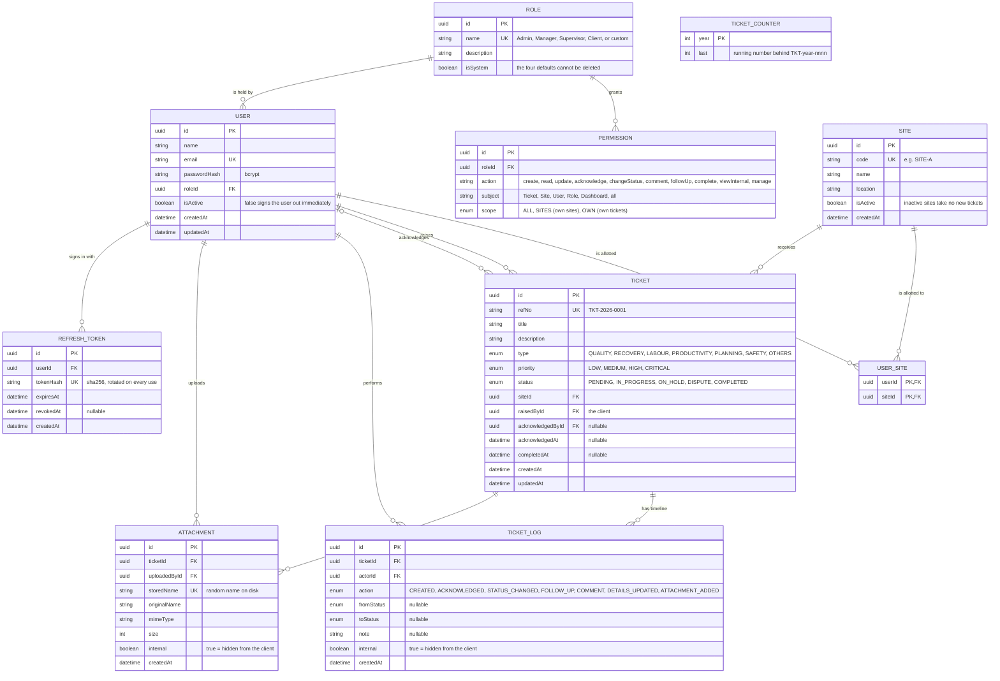
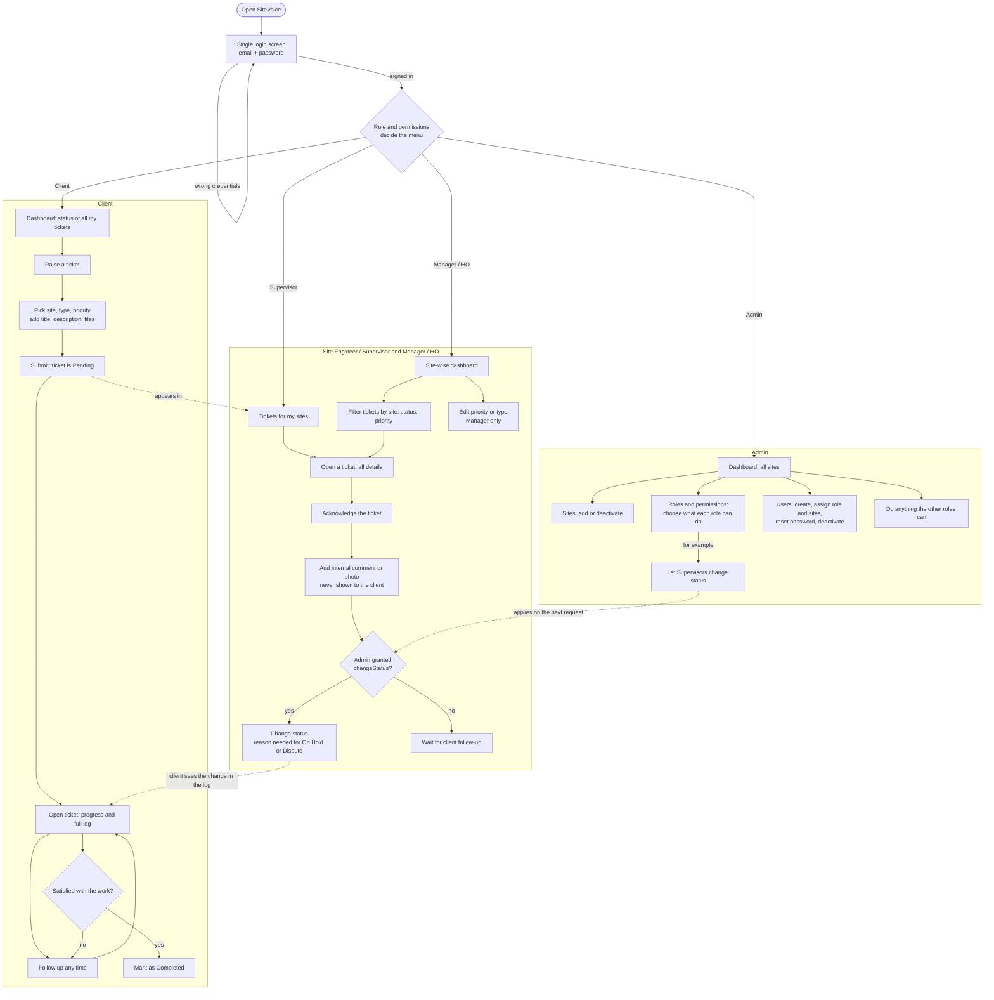
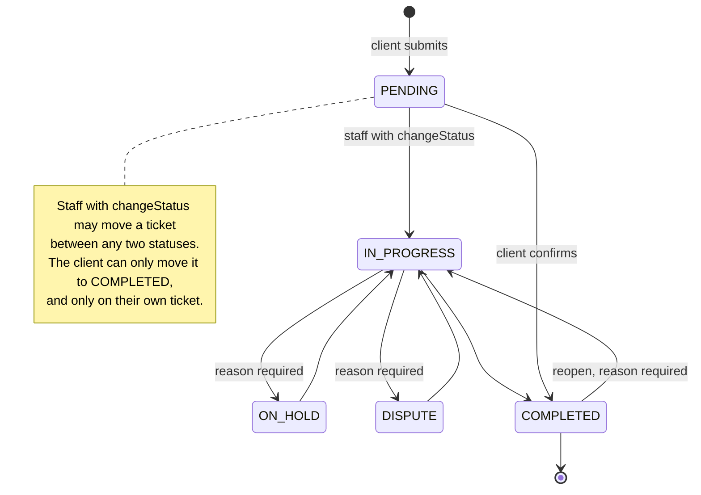
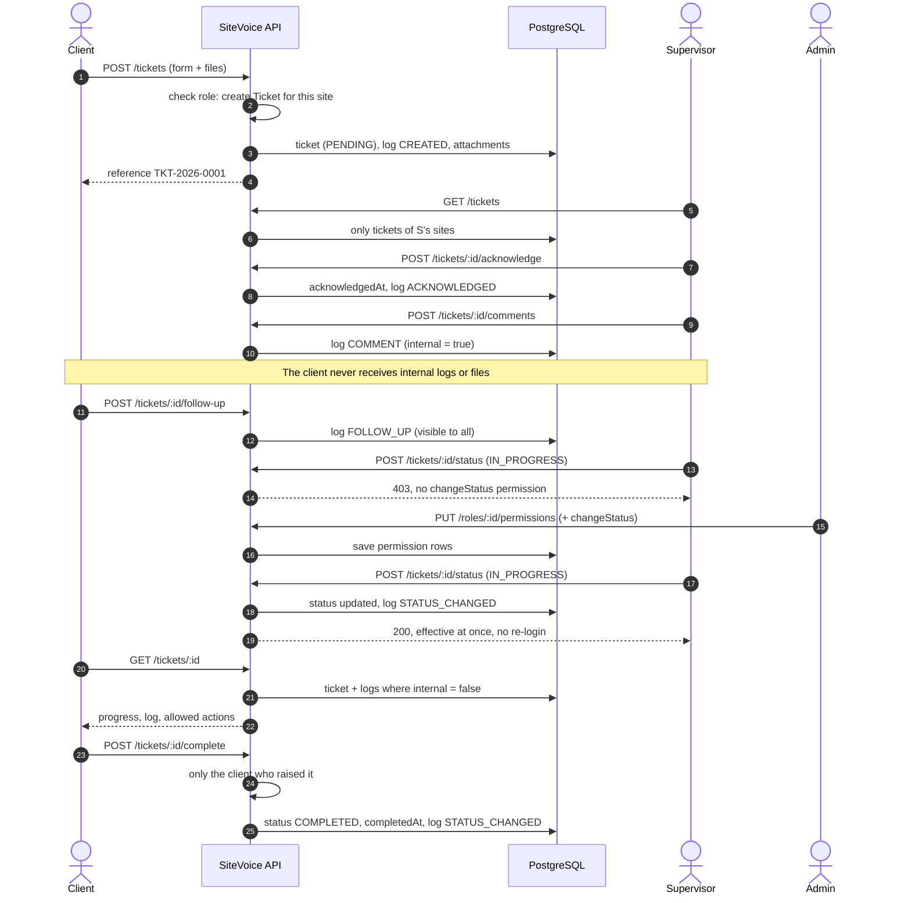
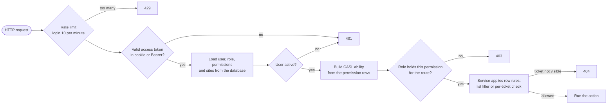

# SiteVoice: database relations and user flow

Diagrams are written in [Mermaid](https://mermaid.js.org); GitHub, GitLab and VS Code render them directly.
They describe what is implemented in `apps/api/prisma/schema.prisma` and `apps/api/src`.

## 1. Database relations

Notes:
- `TICKET_COUNTER` stands alone: it only produces the next reference number.
- Deleting a ticket removes its log and attachments; deleting a role removes its permissions.
- A user's visible sites come from `USER_SITE`. Permissions with scope `SITES` use it; Admins (`manage all`) bypass it.

## 2. User flow by role

## 3. Ticket status lifecycle

## 4. One ticket, end to end

## 5. How each request is authorised

